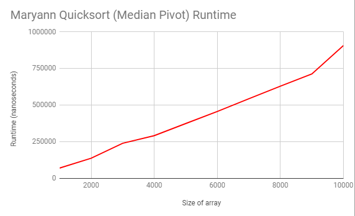

## DustyScreens
#### Maryann Foley, Mohtasim Howlader, Ying Xin Jiang
# QuickSort Results

##### Example
This example implements a choosing of the pivot that is completly random  
Starting array: {7,1,5,12,3}  
choose 4th element  
{7,1,5,3,12}  
choose first element  
{1,5,3,7,12}  
choose 2nd element  
{1,3,5,7,12}  
It wont know that it is sorted, choose first  
{1,3,5,7,12}  
Done  

It took 4 steps, but each step takes n time, so it will be n^2

##### Timing Mechanism/Methodology
1. Record System.nanoTime() before quicksort
2. Record System.nanoTime() after quicksort
3. Print the difference between the two.

##### Best Case
In the best case, the chosen pivot point will end up being the median value, so it will split the array in the middle. It doesn't matter if the array is already sorted since our code doesn't check for a sorted array. 

##### Average Case
In the average case, the runtime appear linear. We tested the runtime from arrays of size 1000 to 500000 and graphed it. The results seems almost perfectly linear. The inacurracies could probably be explained by the machine instead of exceptions of different arrays. 

##### Worst Case
In the worst case, the chosen pivot point will turn out to be on either end of the array, so the subarrays are as maximized as posssible.

#####Hypothesis
Data arrangement doesn't affect our code since we don't check whether or not an array's already sorted. Every array will be sorted by the code regardless. Run time would be affected by the pivot positions. Pivoting from the median would be faster than pivoting from either end of the array. 

### Test Results
#### Median Tests

#### Random Tests

#### Descending Pivot

